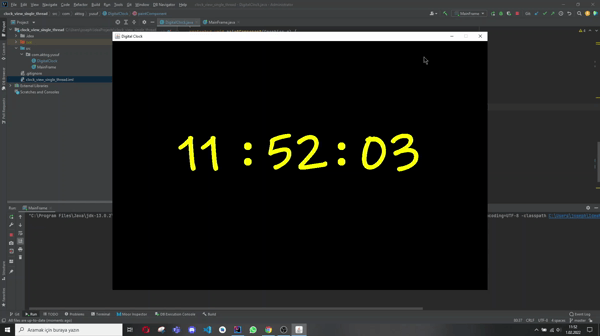

# Digital-clock
Digital clock representation based on counting seconds with single thread

# Summary

---

The algorithm basically increments the seconds then sleep exactly one second.
Second counter resets every 60 seconds
Minute counter is incremented every 60 seconds, reset every 60 minutes
Hours counter is incremented every 60 minutes, reset every 24 hours.

3 counters(seconds, minutes, hours) is being drawn to a panel.

---

